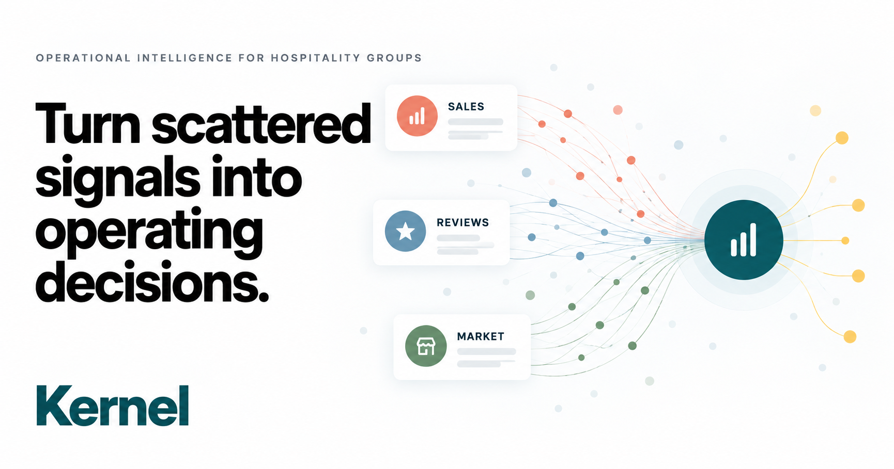

# Storeline

Storeline turns sales, customer reviews, and market context into operating decisions for multi-location hospitality groups.

**Live demo:** [storeline-franchise-intelligence.vercel.app](https://storeline-franchise-intelligence.vercel.app/)



## What the demo includes

- **Today:** a prioritized operating brief across locations
- **Reviews:** location-level comments, themes, and AI synthesis
- **Sales:** product mix, menu photography, modeled unit economics, and AI synthesis
- **Market:** macro signals, competitor evidence, and AI synthesis
- **Next steps:** evidence-linked decisions and executable playbooks
- **Ask Storeline:** retrieval over the connected evidence layer, with optional OpenAI or Anthropic generation

The public evidence layer uses linked market sources, public restaurant information, and review excerpts supplied for the prototype. Sales volumes and margins are curated scenario models for the product demonstration. Storeline is an independent prototype and is not affiliated with Tatte Bakery & Café.

## Architecture

- React 19 and TypeScript
- vinext / Cloudflare Workers runtime
- Cloudflare D1 with Drizzle ORM
- Static Vercel demo build
- Optional OpenAI or Anthropic API connection
- Deterministic bundled answers when no model key is configured

## Run locally

Node.js 22.13 or newer is required.

```bash
npm install
npm run dev
```

Then open the local URL printed by vinext.

## Verify

```bash
npm run lint
npm test
```

## Optional model connection

The application works without an external model key. To enable generated answers, configure one of these variables in the deployment environment:

```bash
ANTHROPIC_API_KEY=...
ANTHROPIC_MODEL=...
```

or:

```bash
OPENAI_API_KEY=...
OPENAI_MODEL=...
```

Never commit environment files or API keys. The repository ignores `.env*` files.

## Project structure

```text
app/                 Application shell and metadata
public/demo/         Interactive Storeline interface
public/brand/        Logo, favicon, and web manifest
public/menu/         Menu photography used by the sales catalog
worker/              Evidence retrieval, model routing, and API endpoints
db/ and drizzle/     D1 schema and migrations
tests/               Rendered-output and asset verification
```
